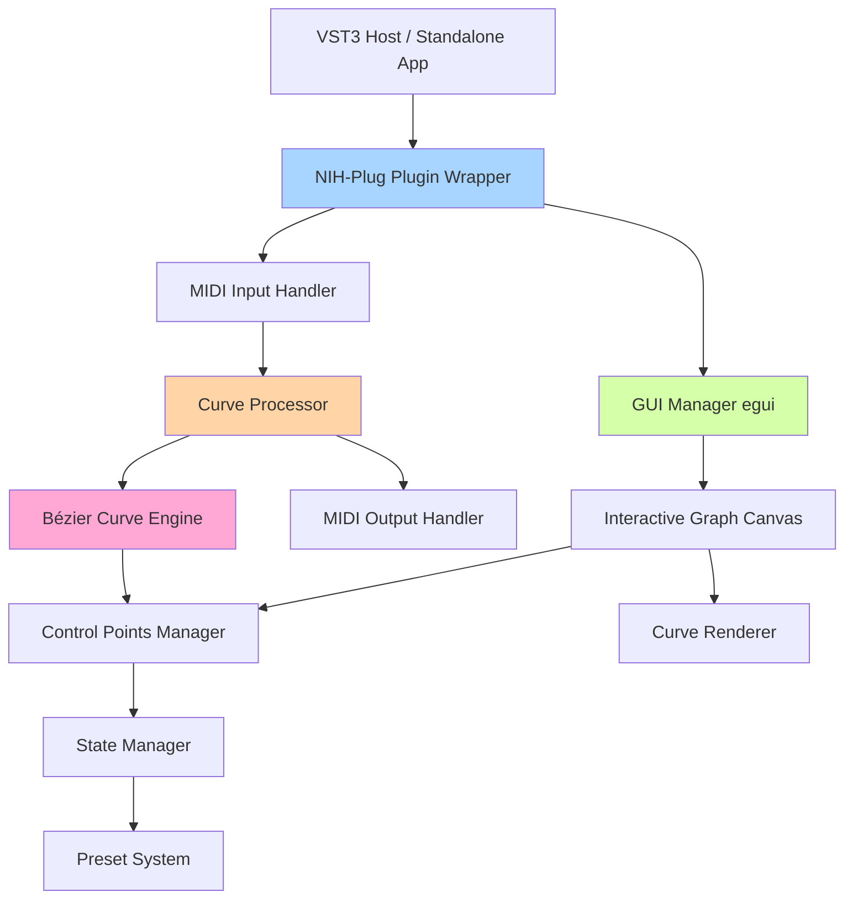

# VST MIDI Curves Plugin Architecture

## 📋 Project Description

Cross-platform VST3 plugin and standalone application in Rust for MIDI message processing using customizable transfer function curves (similar to curves in Photoshop).

### Key Features:
- ✅ Cross-platform (Windows, macOS, Linux)
- ✅ VST3 plugin + standalone application
- ✅ MIDI input/output with velocity processing
- ✅ Interactive graph with Bézier curves
- ✅ Curve editing by dragging control points
- ✅ Adding/removing control points
- ✅ Preset save and load

---

## 🛠️ Technology Stack

### 1. Main Plugin Framework
**[nih-plug](https://github.com/robbert-vdh/nih-plug)** v0.5+
- Modern framework for creating VST3 plugins in Rust
- Built-in standalone mode support
- Excellent egui integration
- Automatic parameter serialization
- Cross-platform compilation

**Why nih-plug?**
- Active development and support
- Excellent documentation and examples
- Built-in MIDI support
- Minimal boilerplate code
- Automatic VST3 metadata generation

### 2. GUI Framework
**[egui](https://github.com/emilk/egui)** v0.28+
- Immediate mode GUI for Rust
- Excellent performance
- Simple and intuitive API
- Built-in support for interactive graphs

**[egui_plot](https://docs.rs/egui_plot/)** - for graphs
- Egui module for graph rendering
- Interactivity support
- Optimized for real-time updates

### 3. Bézier Curve Mathematics
**[kurbo](https://github.com/linebender/kurbo)** v0.11+
- High-performance 2D curve library
- Cubic Bézier curve support
- Optimized computation algorithms
- Integration with egui for rendering

**Alternative:** Custom implementation based on:
```rust
// Cubic Bézier curve: B(t) = (1-t)³P₀ + 3(1-t)²tP₁ + 3(1-t)t²P₂ + t³P₃
```

### 4. MIDI Processing
**Built-in nih-plug types:**
- `NoteEvent` - for MIDI events
- Automatic MIDI buffer processing
- Low latency

### 5. Serialization
**[serde](https://serde.rs/)** v1.0+ with **serde_json**
- Preset save/load
- Automatic plugin state serialization

### 6. Mathematical Utilities
**[nalgebra](https://nalgebra.org/)** v0.33+ (optional)
- For complex vector operations
- Optimized matrix computations

---

## 🏗️ Application Architecture



### Component Structure

#### 1. **Plugin Core** (`src/lib.rs`)
```rust
pub struct MidiCurvesPlugin {
    params: Arc<MidiCurvesParams>,
    curve_processor: CurveProcessor,
    gui_state: Arc<Mutex<GuiState>>,
}
```

#### 2. **Curve Processor** (`src/processor/`)
```rust
pub struct CurveProcessor {
    curve: BezierCurve,
    control_points: Vec<ControlPoint>,
}

impl CurveProcessor {
    fn process_velocity(&self, input: u8) -> u8 {
        // Apply curve to velocity
    }
}
```

#### 3. **Bézier Curve Engine** (`src/curve/`)
```rust
pub struct BezierCurve {
    segments: Vec<CubicBezierSegment>,
}

pub struct ControlPoint {
    position: Vec2,
    handles: (Vec2, Vec2), // Incoming and outgoing tangents
}
```

#### 4. **GUI Manager** (`src/gui/`)
```rust
pub struct MidiCurvesEditor {
    curve_canvas: CurveCanvas,
    selected_point: Option<usize>,
    drag_state: DragState,
}
```

---

## 📂 Project Structure

```
vst_midi_curves/
├── Cargo.toml                  # Dependencies and metadata
├── ARCHITECTURE.md             # This file
├── README.md                   # User documentation
├── src/
│   ├── lib.rs                  # Main plugin file
│   ├── editor.rs               # GUI editor
│   ├── curve/
│   │   ├── mod.rs              # Curves module
│   │   ├── bezier.rs           # Bézier mathematics
│   │   ├── control_point.rs   # Control points
│   │   └── interpolation.rs   # Interpolation
│   ├── processor/
│   │   ├── mod.rs              # MIDI processor
│   │   └── velocity_curve.rs  # Velocity processing
│   ├── gui/
│   │   ├── mod.rs              # GUI module
│   │   ├── canvas.rs           # Graph canvas
│   │   ├── interaction.rs     # Interaction handling
│   │   └── rendering.rs       # Curve rendering
│   ├── params.rs               # Plugin parameters
│   └── presets.rs              # Preset system
├── assets/                     # Resources (icons, fonts)
└── tests/                      # Tests
    ├── curve_tests.rs
    └── midi_tests.rs
```

---

## 🎯 Detailed Development Plan

### Phase 1: Project Setup (1-2 days)

#### Task 1.1: Cargo.toml Update
Add all necessary dependencies:

```toml
[package]
name = "vst_midi_curves"
version = "0.1.0"
edition = "2021"

[dependencies]
nih_plug = { git = "https://github.com/robbert-vdh/nih-plug", features = ["vst3", "standalone"] }
nih_plug_egui = { git = "https://github.com/robbert-vdh/nih-plug" }
egui = "0.28"
serde = { version = "1.0", features = ["derive"] }
serde_json = "1.0"
kurbo = "0.11"

[lib]
crate-type = ["cdylib", "lib"]

[profile.release]
lto = "fat"
opt-level = 3
codegen-units = 1
```
**Note:** Using nih-plug version from git repository, as version 0.5 is not yet published on crates.io.

#### Task 1.2: Create Basic Structure
- Create modular project structure
- Configure builds for different platforms
- Add GitHub Actions for CI/CD (optional)

### Phase 2: Basic Plugin (2-3 days)

#### Task 2.1: Minimal VST3 Plugin
Create a simple plugin with nih-plug:

```rust
// src/lib.rs
use nih_plug::prelude::*;
use std::sync::Arc;

struct MidiCurvesPlugin {
    params: Arc<MidiCurvesParams>,
}

#[derive(Params)]
struct MidiCurvesParams {}

impl Default for MidiCurvesPlugin {
    fn default() -> Self {
        Self {
            params: Arc::new(MidiCurvesParams::default()),
        }
    }
}

impl Plugin for MidiCurvesPlugin {
    const NAME: &'static str = "MIDI Curves";
    const VENDOR: &'static str = "Your Name";
    const URL: &'static str = "https://yoursite.com";
    const EMAIL: &'static str = "your@email.com";
    const VERSION: &'static str = env!("CARGO_PKG_VERSION");

    type BackgroundTask = ();
    type SysExMessage = ();

    fn params(&self) -> Arc<dyn Params> {
        self.params.clone()
    }

    // ... other methods
}

nih_plug::nih_export_vst3!(MidiCurvesPlugin);
```

#### Task 2.2: MIDI pass-through
Implement simple MIDI pass-through without processing:

```rust
impl Plugin for MidiCurvesPlugin {
    fn process(&mut self, buffer: &mut Buffer, context: &mut impl ProcessContext<Self>) 
        -> ProcessStatus {
        while let Some(event) = context.next_event() {
            match event {
                NoteEvent::NoteOn { note, velocity, .. } => {
                    // For now just pass through
                    context.send_event(event);
                }
                _ => context.send_event(event),
            }
        }
        ProcessStatus::Normal
    }
}
```

---

### Phase 3: Mathematical Curve Model (3-4 days)

#### Task 3.1: Basic Bézier Curve Structure
```rust
// src/curve/bezier.rs
use kurbo::{BezierPath, Point, Vec2};

pub struct BezierCurve {
    control_points: Vec<ControlPoint>,
    cached_lut: Vec<Point>, // Look-up table for optimization
}

pub struct ControlPoint {
    pub position: Point,
    pub handle_in: Vec2,
    pub handle_out: Vec2,
}

impl BezierCurve {
    pub fn new() -> Self {
        // Initialize with linear curve (y = x)
        Self {
            control_points: vec![
                ControlPoint::new(Point::new(0.0, 0.0)),
                ControlPoint::new(Point::new(127.0, 127.0)),
            ],
            cached_lut: Vec::new(),
        }
    }

    pub fn evaluate(&self, x: f32) -> f32 {
        // Compute curve value at point x
        // Use LUT for optimization
    }

    pub fn add_control_point(&mut self, position: Point) {
        // Add new point with automatic tangents
    }

    pub fn remove_control_point(&mut self, index: usize) {
        // Remove point (except first and last)
    }

    pub fn update_control_point(&mut self, index: usize, position: Point) {
        // Update point position
    }

    fn rebuild_lut(&mut self) {
        // Rebuild value table for fast access
    }
}
```

#### Task 3.2: Interpolation Algorithm
```rust
// src/curve/interpolation.rs
pub fn cubic_bezier(t: f32, p0: f32, p1: f32, p2: f32, p3: f32) -> f32 {
    let t2 = t * t;
    let t3 = t2 * t;
    let mt = 1.0 - t;
    let mt2 = mt * mt;
    let mt3 = mt2 * mt;
    
    mt3 * p0 + 3.0 * mt2 * t * p1 + 3.0 * mt * t2 * p2 + t3 * p3
}

pub fn find_x_for_t(curve: &BezierCurve, x_target: f32) -> f32 {
    // Binary search for t value for given x
    // Newton-Raphson for exact solution
}
```

#### Task 3.3: Look-Up Table Optimization
Create pre-computed table for real-time processing:
- 128 values (0-127 for MIDI velocity)
- Update when curve changes
- Linear interpolation between values

---

### Phase 4: MIDI Processing Integration (2 days)

#### Task 4.1: Velocity Processor
```rust
// src/processor/velocity_curve.rs
pub struct VelocityCurveProcessor {
    curve: BezierCurve,
}

impl VelocityCurveProcessor {
    pub fn process_velocity(&self, input_velocity: u8) -> u8 {
        let normalized_input = input_velocity as f32 / 127.0;
        let normalized_output = self.curve.evaluate(normalized_input);
        (normalized_output * 127.0).clamp(0.0, 127.0) as u8
    }
}
```

#### Task 4.2: Plugin Integration
```rust
impl Plugin for MidiCurvesPlugin {
    fn process(&mut self, buffer: &mut Buffer, context: &mut impl ProcessContext<Self>) 
        -> ProcessStatus {
        while let Some(event) = context.next_event() {
            match event {
                NoteEvent::NoteOn { timing, voice_id, channel, note, velocity } => {
                    let processed_velocity = self.curve_processor
                        .process_velocity((velocity * 127.0) as u8);
                    
                    context.send_event(NoteEvent::NoteOn {
                        timing,
                        voice_id,
                        channel,
                        note,
                        velocity: processed_velocity as f32 / 127.0,
                    });
                }
                _ => context.send_event(event),
            }
        }
        ProcessStatus::Normal
    }
}
```

---

### Phase 5: GUI - Basic Graph (3-4 days)

#### Task 5.1: Egui Editor
```rust
// src/editor.rs
use nih_plug_egui::{create_egui_editor, egui, EguiState};

pub fn create_editor() -> Option<Box<dyn Editor>> {
    create_egui_editor(
        EguiState::from_size(800, 600),
        (),
        |egui_ctx, setter, state| {
            egui::CentralPanel::default().show(egui_ctx, |ui| {
                // GUI code here
            });
        },
    )
}
```

#### Task 5.2: Graph Canvas
```rust
// src/gui/canvas.rs
use egui::*;

pub struct CurveCanvas {
    curve: BezierCurve,
    size: Vec2,
}

impl CurveCanvas {
    pub fn ui(&mut self, ui: &mut Ui) -> Response {
        let (response, painter) = ui.allocate_painter(
            Vec2::new(600.0, 400.0),
            Sense::click_and_drag(),
        );

        // Draw grid
        self.draw_grid(&painter, response.rect);
        
        // Draw curve
        self.draw_curve(&painter, response.rect);
        
        // Draw control points
        self.draw_control_points(&painter, response.rect);

        response
    }

    fn draw_grid(&self, painter: &Painter, rect: Rect) {
        // Draw coordinate grid
        let grid_color = Color32::from_gray(40);
        
        for i in 0..=10 {
            let x = rect.left() + (rect.width() * i as f32 / 10.0);
            let y = rect.top() + (rect.height() * i as f32 / 10.0);
            
            painter.line_segment(
                [pos2(x, rect.top()), pos2(x, rect.bottom())],
                Stroke::new(1.0, grid_color),
            );
            
            painter.line_segment(
                [pos2(rect.left(), y), pos2(rect.right(), y)],
                Stroke::new(1.0, grid_color),
            );
        }
    }

    fn draw_curve(&self, painter: &Painter, rect: Rect) {
        // Draw Bézier curve
        let mut points = Vec::new();
        for i in 0..=100 {
            let t = i as f32 / 100.0;
            let x = rect.left() + t * rect.width();
            let y_norm = self.curve.evaluate(t);
            let y = rect.bottom() - y_norm * rect.height();
            points.push(pos2(x, y));
        }

        painter.add(Shape::line(
            points,
            Stroke::new(2.0, Color32::from_rgb(100, 200, 255)),
        ));
    }

    fn draw_control_points(&self, painter: &Painter, rect: Rect) {
        // Draw control points
        for point in &self.curve.control_points {
            let screen_pos = self.world_to_screen(point.position, rect);
            
            painter.circle_filled(
                screen_pos,
                8.0,
                Color32::from_rgb(255, 100, 100),
            );
            
            // Draw tangents
            // ...
        }
    }

    fn world_to_screen(&self, world_pos: Point, rect: Rect) -> Pos2 {
        pos2(
            rect.left() + world_pos.x / 127.0 * rect.width(),
            rect.bottom() - world_pos.y / 127.0 * rect.height(),
        )
    }

    fn screen_to_world(&self, screen_pos: Pos2, rect: Rect) -> Point {
        Point::new(
            (screen_pos.x - rect.left()) / rect.width() * 127.0,
            (rect.bottom() - screen_pos.y) / rect.height() * 127.0,
        )
    }
}
```

---

### Phase 6: Interactivity (3-4 days)

#### Task 6.1: Click and Drag Handling
```rust
// src/gui/interaction.rs
pub struct InteractionHandler {
    selected_point: Option<usize>,
    dragging: bool,
    drag_start: Option<Pos2>,
}

impl InteractionHandler {
    pub fn handle_input(
        &mut self,
        response: &Response,
        curve: &mut BezierCurve,
        rect: Rect,
    ) {
        // Handle clicks for point selection
        if response.clicked() {
            if let Some(hover_pos) = response.hover_pos() {
                self.selected_point = self.find_point_at(hover_pos, curve, rect);
            }
        }

        // Point dragging
        if response.dragged() {
            if let Some(selected) = self.selected_point {
                if let Some(hover_pos) = response.hover_pos() {
                    let world_pos = screen_to_world(hover_pos, rect);
                    curve.update_control_point(selected, world_pos);
                }
            }
        }

        // Double click to add point
        if response.double_clicked() {
            if let Some(hover_pos) = response.hover_pos() {
                let world_pos = screen_to_world(hover_pos, rect);
                curve.add_control_point(world_pos);
            }
        }

        // Right click to delete point
        if response.secondary_clicked() {
            if let Some(hover_pos) = response.hover_pos() {
                if let Some(point_idx) = self.find_point_at(hover_pos, curve, rect) {
                    curve.remove_control_point(point_idx);
                }
            }
        }
    }

    fn find_point_at(
        &self,
        screen_pos: Pos2,
        curve: &BezierCurve,
        rect: Rect,
    ) -> Option<usize> {
        const CLICK_RADIUS: f32 = 12.0;
        
        for (i, point) in curve.control_points.iter().enumerate() {
            let point_screen = world_to_screen(point.position, rect);
            if screen_pos.distance(point_screen) < CLICK_RADIUS {
                return Some(i);
            }
        }
        None
    }
}
```

#### Task 6.2: Visual Feedback
- Point highlight on hover
- Cursor change
- Coordinate display during dragging
- Point addition/deletion animation

#### Task 6.3: Tangent Handling
```rust
// Edit tangent points for fine curve adjustment
pub fn handle_tangent_editing(
    point: &mut ControlPoint,
    handle_type: HandleType,
    new_position: Vec2,
) {
    match handle_type {
        HandleType::In => {
            point.handle_in = new_position;
            // Optionally: mirroring for symmetric tangents
            if point.symmetric_handles {
                point.handle_out = -new_position;
            }
        }
        HandleType::Out => {
            point.handle_out = new_position;
            if point.symmetric_handles {
                point.handle_in = -new_position;
            }
        }
    }
}
```

---

### Phase 7: Preset System (2 days)

#### Task 7.1: State Serialization
```rust
// src/presets.rs
use serde::{Deserialize, Serialize};

#[derive(Serialize, Deserialize)]
pub struct CurvePreset {
    pub name: String,
    pub control_points: Vec<SerializableControlPoint>,
}

#[derive(Serialize, Deserialize)]
pub struct SerializableControlPoint {
    pub x: f32,
    pub y: f32,
    pub handle_in_x: f32,
    pub handle_in_y: f32,
    pub handle_out_x: f32,
    pub handle_out_y: f32,
}

impl CurvePreset {
    pub fn save_to_file(&self, path: &Path) -> Result<()> {
        let json = serde_json::to_string_pretty(self)?;
        std::fs::write(path, json)?;
        Ok(())
    }

    pub fn load_from_file(path: &Path) -> Result<Self> {
        let json = std::fs::read_to_string(path)?;
        let preset = serde_json::from_str(&json)?;
        Ok(preset)
    }
}
```

#### Task 7.2: Preset UI
```rust
// Add to GUI:
// - "Save Preset" button
// - Preset dropdown list
// - "Load Preset" button
// - Built-in presets (Linear, S-curve, Exponential, etc.)

pub fn default_presets() -> Vec<CurvePreset> {
    vec![
        CurvePreset::linear(),
        CurvePreset::s_curve(),
        CurvePreset::exponential(),
        CurvePreset::logarithmic(),
    ]
}
```

---

### Phase 8: Optimization and Polish (2-3 days)

#### Task 8.1: Performance
- Profiling with cargo-flamegraph
- Optimize LUT size and updates
- Minimize allocations in audio thread
- Vectorize computations where possible

#### Task 8.2: GUI Improvements
```rust
// Additional UI elements:
// - Reset button (reset to linear curve)
// - Undo/Redo
// - Zoom and Pan
// - Save last state
// - Dark/light theme
// - Grid settings
```

#### Task 8.3: Error Handling
- Curve validation (X monotonicity)
- Handle invalid presets
- Graceful degradation on errors
- Logging for debugging

---

### Phase 9: Testing (2-3 days)

#### Task 9.1: Unit Tests
```rust
// tests/curve_tests.rs
#[cfg(test)]
mod tests {
    use super::*;

    #[test]
    fn test_linear_curve() {
        let curve = BezierCurve::linear();
        assert_eq!(curve.evaluate(0.0), 0.0);
        assert_eq!(curve.evaluate(0.5), 0.5);
        assert_eq!(curve.evaluate(1.0), 1.0);
    }

    #[test]
    fn test_velocity_processing() {
        let processor = VelocityCurveProcessor::new();
        assert_eq!(processor.process_velocity(64), 64); // Linear pass-through
    }

    #[test]
    fn test_control_point_addition() {
        let mut curve = BezierCurve::new();
        curve.add_control_point(Point::new(64.0, 64.0));
        assert_eq!(curve.control_points.len(), 3);
    }
}
```

#### Task 9.2: Integration Testing
- Testing in different DAWs (Reaper, Ableton, FL Studio)
- Check MIDI routing
- Test standalone version
- Stress testing with large MIDI event counts

#### Task 9.3: Cross-platform Testing
- Windows 10/11
- macOS (Intel and Apple Silicon)
- Linux (various distributions)

---

### Phase 10: Build and Distribution (1-2 days)

#### Task 10.1: Build Configuration
```bash
# Windows
cargo build --release

# macOS (Universal Binary)
cargo build --release --target x86_64-apple-darwin
cargo build --release --target aarch64-apple-darwin
lipo -create target/x86_64-apple-darwin/release/*.dylib \
     target/aarch64-apple-darwin/release/*.dylib \
     -output MidiCurves.vst3

# Linux
cargo build --release --target x86_64-unknown-linux-gnu
```

#### Task 10.2: Documentation
- README with installation instructions
- User manual
- Usage examples
- Troubleshooting guide

---

## 🔧 Development Recommendations

### Best Practices

1. **Audio Thread Safety**
   - Never allocate memory in audio thread
   - Use lock-free data structures
   - Pre-compute values where possible

2. **GUI Performance**
   - Update GUI only on changes
   - Use dirty flags
   - Cache rendered elements

3. **MIDI Processing**
   - Always consider MIDI event timing
   - Minimal latency
   - Process all types of MIDI messages

4. **Testing**
   - Write tests for critical functions
   - Regression testing
   - Performance profiling

### Commit Structure

```
feat: Add basic Bézier curve implementation
fix: Correct velocity mapping for extreme values
refactor: Optimize LUT rebuilding
docs: Update architecture documentation
test: Add curve interpolation tests
```

---

## 📚 Additional Resources

### Documentation
- [NIH-plug Book](https://nih-plug.robbert.vdh.org/)
- [egui Documentation](https://docs.rs/egui/latest/egui/)
- [Kurbo Documentation](https://docs.rs/kurbo/latest/kurbo/)

### Example Projects
- [NIH-plug Examples](https://github.com/robbert-vdh/nih-plug/tree/master/plugins)
- [egui Demo App](https://github.com/emilk/egui/tree/master/crates/egui_demo_app)

### Theory
- [Bézier Curves - Primer](https://pomax.github.io/bezierinfo/)
- [MIDI Specification](https://www.midi.org/specifications)
- [VST3 SDK Documentation](https://steinbergmedia.github.io/vst3_doc/)

---

## 🎯 Time Estimates

### Basic Version (MVP): ~3-4 weeks
- Phases 1-6: Functioning plugin with basic GUI

### Full Version: ~6-8 weeks
- All phases including testing and polishing

### Extended Version: +2-3 weeks
- Additional features (presets, extended UI, automation)

---

## 🚀 Next Steps

After plan approval:

1. **Confirm technology stack**
2. **Start with Phase 1**: Project setup
3. **Switch to Code Mode** for implementation
4. **Iterative development** by phases

---

**Creation Date:** 2025-10-13  
**Document Version:** 1.0  
**Status:** Awaiting Approval