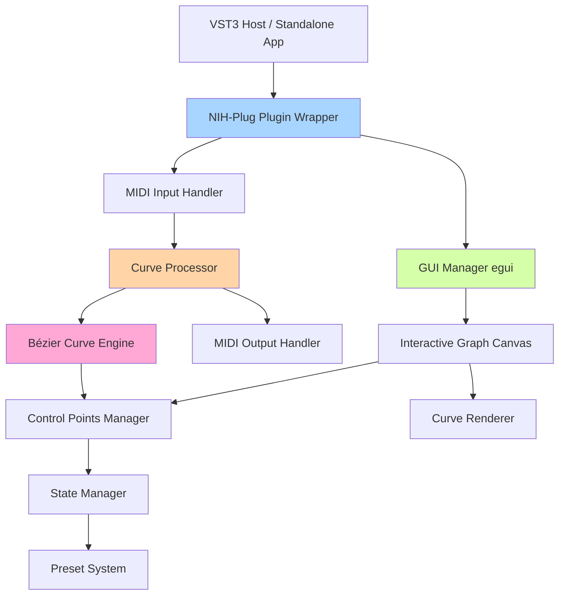

# Архитектура VST MIDI Curves Plugin

## 📋 Описание проекта

Кроссплатформенный VST3-плагин и standalone-приложение на Rust для обработки MIDI-сообщений с использованием настраиваемых кривых передаточных функций (подобно кривым в Photoshop).

### Основные возможности:
- ✅ Мультиплатформенность (Windows, macOS, Linux)
- ✅ VST3 плагин + standalone приложение
- ✅ MIDI вход/выход с обработкой velocity
- ✅ Интерактивный график с кривыми Безье
- ✅ Редактирование кривой перетаскиванием управляющих точек
- ✅ Добавление/удаление контрольных точек
- ✅ Сохранение и загрузка пресетов

---

## 🛠️ Технологический стек

### 1. Основной фреймворк плагина
**[nih-plug](https://github.com/robbert-vdh/nih-plug)** v0.5+
- Современный фреймворк для создания VST3 плагинов на Rust
- Поддержка standalone-режима из коробки
- Отличная интеграция с egui
- Автоматическая сериализация параметров
- Кроссплатформенная компиляция

**Почему nih-plug?**
- Активная разработка и поддержка
- Отличная документация и примеры
- Встроенная поддержка MIDI
- Минимальный boilerplate код
- Автоматическая генерация VST3 метаданных

### 2. GUI фреймворк
**[egui](https://github.com/emilk/egui)** v0.28+
- Immediate mode GUI для Rust
- Отличная производительность
- Простой и интуитивный API
- Встроенная поддержка интерактивных графиков

**[egui_plot](https://docs.rs/egui_plot/)** - для графиков
- Модуль egui для отрисовки графиков
- Поддержка интерактивности
- Оптимизирован для real-time обновлений

### 3. Математика кривых Безье
**[kurbo](https://github.com/linebender/kurbo)** v0.11+
- Высокопроизводительная библиотека 2D кривых
- Поддержка кубических кривых Безье
- Оптимизированные алгоритмы вычислений
- Интеграция с egui для отрисовки

**Альтернатива:** Собственная реализация на основе:
```rust
// Кубическая кривая Безье: B(t) = (1-t)³P₀ + 3(1-t)²tP₁ + 3(1-t)t²P₂ + t³P₃
```

### 4. MIDI обработка
**Встроенные типы nih-plug:**
- `NoteEvent` - для MIDI событий
- Автоматическая обработка MIDI буферов
- Низкая латентность

### 5. Сериализация
**[serde](https://serde.rs/)** v1.0+ с **serde_json**
- Сохранение/загрузка пресетов
- Автоматическая сериализация состояния плагина

### 6. Математические утилиты
**[nalgebra](https://nalgebra.org/)** v0.33+ (опционально)
- Для сложных векторных операций
- Оптимизированные матричные вычисления

---

## 🏗️ Архитектура приложения



### Компонентная структура

#### 1. **Plugin Core** (`src/lib.rs`)
```rust
pub struct MidiCurvesPlugin {
    params: Arc<MidiCurvesParams>,
    curve_processor: CurveProcessor,
    gui_state: Arc<Mutex<GuiState>>,
}
```

#### 2. **Curve Processor** (`src/processor/`)
```rust
pub struct CurveProcessor {
    curve: BezierCurve,
    control_points: Vec<ControlPoint>,
}

impl CurveProcessor {
    fn process_velocity(&self, input: u8) -> u8 {
        // Применение кривой к velocity
    }
}
```

#### 3. **Bézier Curve Engine** (`src/curve/`)
```rust
pub struct BezierCurve {
    segments: Vec<CubicBezierSegment>,
}

pub struct ControlPoint {
    position: Vec2,
    handles: (Vec2, Vec2), // Входящая и исходящая касательные
}
```

#### 4. **GUI Manager** (`src/gui/`)
```rust
pub struct MidiCurvesEditor {
    curve_canvas: CurveCanvas,
    selected_point: Option<usize>,
    drag_state: DragState,
}
```

---

## 📂 Структура проекта

```
vst_midi_curves/
├── Cargo.toml                  # Зависимости и метаданные
├── ARCHITECTURE.md             # Этот файл
├── README.md                   # Документация пользователя
├── src/
│   ├── lib.rs                  # Основной файл плагина
│   ├── editor.rs               # GUI редактор
│   ├── curve/
│   │   ├── mod.rs              # Модуль кривых
│   │   ├── bezier.rs           # Математика Безье
│   │   ├── control_point.rs   # Управляющие точки
│   │   └── interpolation.rs   # Интерполяция
│   ├── processor/
│   │   ├── mod.rs              # MIDI процессор
│   │   └── velocity_curve.rs  # Обработка velocity
│   ├── gui/
│   │   ├── mod.rs              # GUI модуль
│   │   ├── canvas.rs           # Canvas для графика
│   │   ├── interaction.rs     # Обработка взаимодействий
│   │   └── rendering.rs       # Отрисовка кривой
│   ├── params.rs               # Параметры плагина
│   └── presets.rs              # Система пресетов
├── assets/                     # Ресурсы (иконки, шрифты)
└── tests/                      # Тесты
    ├── curve_tests.rs
    └── midi_tests.rs
```

---

## 🎯 Детальный план разработки

### Этап 1: Настройка проекта (1-2 дня)

#### Задача 1.1: Обновление Cargo.toml
Добавить все необходимые зависимости:

```toml
[package]
name = "vst_midi_curves"
version = "0.1.0"
edition = "2021"

[dependencies]
nih_plug = { git = "https://github.com/robbert-vdh/nih-plug", features = ["vst3", "standalone"] }
nih_plug_egui = { git = "https://github.com/robbert-vdh/nih-plug" }
egui = "0.28"
serde = { version = "1.0", features = ["derive"] }
serde_json = "1.0"
kurbo = "0.11"

[lib]
crate-type = ["cdylib", "lib"]

[profile.release]
lto = "fat"
opt-level = 3
codegen-units = 1
```
**Примечание:** Используется версия nih-plug из git-репозитория, так как версия 0.5 еще не опубликована на crates.io.

#### Задача 1.2: Создание базовой структуры
- Создать модульную структуру проекта
- Настроить сборку для разных платформ
- Добавить GitHub Actions для CI/CD (опционально)

### Этап 2: Базовый плагин (2-3 дня)

#### Задача 2.1: Минимальный VST3 плагин
Создать простейший плагин с nih-plug:

```rust
// src/lib.rs
use nih_plug::prelude::*;
use std::sync::Arc;

struct MidiCurvesPlugin {
    params: Arc<MidiCurvesParams>,
}

#[derive(Params)]
struct MidiCurvesParams {}

impl Default for MidiCurvesPlugin {
    fn default() -> Self {
        Self {
            params: Arc::new(MidiCurvesParams::default()),
        }
    }
}

impl Plugin for MidiCurvesPlugin {
    const NAME: &'static str = "MIDI Curves";
    const VENDOR: &'static str = "Your Name";
    const URL: &'static str = "https://yoursite.com";
    const EMAIL: &'static str = "your@email.com";
    const VERSION: &'static str = env!("CARGO_PKG_VERSION");

    type BackgroundTask = ();
    type SysExMessage = ();

    fn params(&self) -> Arc<dyn Params> {
        self.params.clone()
    }

    // ... остальные методы
}

nih_plug::nih_export_vst3!(MidiCurvesPlugin);
```

#### Задача 2.2: MIDI pass-through
Реализовать простое пропускание MIDI без обработки:

```rust
impl Plugin for MidiCurvesPlugin {
    fn process(&mut self, buffer: &mut Buffer, context: &mut impl ProcessContext<Self>) 
        -> ProcessStatus {
        while let Some(event) = context.next_event() {
            match event {
                NoteEvent::NoteOn { note, velocity, .. } => {
                    // Пока просто пропускаем
                    context.send_event(event);
                }
                _ => context.send_event(event),
            }
        }
        ProcessStatus::Normal
    }
}
```

---

### Этап 3: Математическая модель кривых (3-4 дня)

#### Задача 3.1: Базовая структура кривой Безье
```rust
// src/curve/bezier.rs
use kurbo::{BezierPath, Point, Vec2};

pub struct BezierCurve {
    control_points: Vec<ControlPoint>,
    cached_lut: Vec<Point>, // Look-up table для оптимизации
}

pub struct ControlPoint {
    pub position: Point,
    pub handle_in: Vec2,
    pub handle_out: Vec2,
}

impl BezierCurve {
    pub fn new() -> Self {
        // Инициализация с линейной кривой (y = x)
        Self {
            control_points: vec![
                ControlPoint::new(Point::new(0.0, 0.0)),
                ControlPoint::new(Point::new(127.0, 127.0)),
            ],
            cached_lut: Vec::new(),
        }
    }

    pub fn evaluate(&self, x: f32) -> f32 {
        // Вычисление значения кривой в точке x
        // Использование LUT для оптимизации
    }

    pub fn add_control_point(&mut self, position: Point) {
        // Добавление новой точки с автоматическими касательными
    }

    pub fn remove_control_point(&mut self, index: usize) {
        // Удаление точки (кроме первой и последней)
    }

    pub fn update_control_point(&mut self, index: usize, position: Point) {
        // Обновление позиции точки
    }

    fn rebuild_lut(&mut self) {
        // Перестроение таблицы значений для быстрого доступа
    }
}
```

#### Задача 3.2: Алгоритм интерполяции
```rust
// src/curve/interpolation.rs
pub fn cubic_bezier(t: f32, p0: f32, p1: f32, p2: f32, p3: f32) -> f32 {
    let t2 = t * t;
    let t3 = t2 * t;
    let mt = 1.0 - t;
    let mt2 = mt * mt;
    let mt3 = mt2 * mt;
    
    mt3 * p0 + 3.0 * mt2 * t * p1 + 3.0 * mt * t2 * p2 + t3 * p3
}

pub fn find_x_for_t(curve: &BezierCurve, x_target: f32) -> f32 {
    // Бинарный поиск значения t для данного x
    // Ньютон-Рафсон для точного решения
}
```

#### Задача 3.3: Оптимизация с Look-Up Table
Создать предварительно вычисленную таблицу для real-time обработки:
- 128 значений (0-127 для MIDI velocity)
- Обновление при изменении кривой
- Линейная интерполяция между значениями

---

### Этап 4: Интеграция MIDI обработки (2 дня)

#### Задача 4.1: Velocity Processor
```rust
// src/processor/velocity_curve.rs
pub struct VelocityCurveProcessor {
    curve: BezierCurve,
}

impl VelocityCurveProcessor {
    pub fn process_velocity(&self, input_velocity: u8) -> u8 {
        let normalized_input = input_velocity as f32 / 127.0;
        let normalized_output = self.curve.evaluate(normalized_input);
        (normalized_output * 127.0).clamp(0.0, 127.0) as u8
    }
}
```

#### Задача 4.2: Интеграция в плагин
```rust
impl Plugin for MidiCurvesPlugin {
    fn process(&mut self, buffer: &mut Buffer, context: &mut impl ProcessContext<Self>) 
        -> ProcessStatus {
        while let Some(event) = context.next_event() {
            match event {
                NoteEvent::NoteOn { timing, voice_id, channel, note, velocity } => {
                    let processed_velocity = self.curve_processor
                        .process_velocity((velocity * 127.0) as u8);
                    
                    context.send_event(NoteEvent::NoteOn {
                        timing,
                        voice_id,
                        channel,
                        note,
                        velocity: processed_velocity as f32 / 127.0,
                    });
                }
                _ => context.send_event(event),
            }
        }
        ProcessStatus::Normal
    }
}
```

---

### Этап 5: GUI - Базовый график (3-4 дня)

#### Задача 5.1: Egui Editor
```rust
// src/editor.rs
use nih_plug_egui::{create_egui_editor, egui, EguiState};

pub fn create_editor() -> Option<Box<dyn Editor>> {
    create_egui_editor(
        EguiState::from_size(800, 600),
        (),
        |egui_ctx, setter, state| {
            egui::CentralPanel::default().show(egui_ctx, |ui| {
                // GUI код здесь
            });
        },
    )
}
```

#### Задача 5.2: Canvas для графика
```rust
// src/gui/canvas.rs
use egui::*;

pub struct CurveCanvas {
    curve: BezierCurve,
    size: Vec2,
}

impl CurveCanvas {
    pub fn ui(&mut self, ui: &mut Ui) -> Response {
        let (response, painter) = ui.allocate_painter(
            Vec2::new(600.0, 400.0),
            Sense::click_and_drag(),
        );

        // Отрисовка сетки
        self.draw_grid(&painter, response.rect);
        
        // Отрисовка кривой
        self.draw_curve(&painter, response.rect);
        
        // Отрисовка контрольных точек
        self.draw_control_points(&painter, response.rect);

        response
    }

    fn draw_grid(&self, painter: &Painter, rect: Rect) {
        // Отрисовка координатной сетки
        let grid_color = Color32::from_gray(40);
        
        for i in 0..=10 {
            let x = rect.left() + (rect.width() * i as f32 / 10.0);
            let y = rect.top() + (rect.height() * i as f32 / 10.0);
            
            painter.line_segment(
                [pos2(x, rect.top()), pos2(x, rect.bottom())],
                Stroke::new(1.0, grid_color),
            );
            
            painter.line_segment(
                [pos2(rect.left(), y), pos2(rect.right(), y)],
                Stroke::new(1.0, grid_color),
            );
        }
    }

    fn draw_curve(&self, painter: &Painter, rect: Rect) {
        // Отрисовка кривой Безье
        let mut points = Vec::new();
        for i in 0..=100 {
            let t = i as f32 / 100.0;
            let x = rect.left() + t * rect.width();
            let y_norm = self.curve.evaluate(t);
            let y = rect.bottom() - y_norm * rect.height();
            points.push(pos2(x, y));
        }

        painter.add(Shape::line(
            points,
            Stroke::new(2.0, Color32::from_rgb(100, 200, 255)),
        ));
    }

    fn draw_control_points(&self, painter: &Painter, rect: Rect) {
        // Отрисовка управляющих точек
        for point in &self.curve.control_points {
            let screen_pos = self.world_to_screen(point.position, rect);
            
            painter.circle_filled(
                screen_pos,
                8.0,
                Color32::from_rgb(255, 100, 100),
            );
            
            // Отрисовка касательных
            // ...
        }
    }

    fn world_to_screen(&self, world_pos: Point, rect: Rect) -> Pos2 {
        pos2(
            rect.left() + world_pos.x / 127.0 * rect.width(),
            rect.bottom() - world_pos.y / 127.0 * rect.height(),
        )
    }

    fn screen_to_world(&self, screen_pos: Pos2, rect: Rect) -> Point {
        Point::new(
            (screen_pos.x - rect.left()) / rect.width() * 127.0,
            (rect.bottom() - screen_pos.y) / rect.height() * 127.0,
        )
    }
}
```

---

### Этап 6: Интерактивность (3-4 дня)

#### Задача 6.1: Обработка кликов и перетаскивания
```rust
// src/gui/interaction.rs
pub struct InteractionHandler {
    selected_point: Option<usize>,
    dragging: bool,
    drag_start: Option<Pos2>,
}

impl InteractionHandler {
    pub fn handle_input(
        &mut self,
        response: &Response,
        curve: &mut BezierCurve,
        rect: Rect,
    ) {
        // Обработка кликов для выбора точки
        if response.clicked() {
            if let Some(hover_pos) = response.hover_pos() {
                self.selected_point = self.find_point_at(hover_pos, curve, rect);
            }
        }

        // Перетаскивание точки
        if response.dragged() {
            if let Some(selected) = self.selected_point {
                if let Some(hover_pos) = response.hover_pos() {
                    let world_pos = screen_to_world(hover_pos, rect);
                    curve.update_control_point(selected, world_pos);
                }
            }
        }

        // Двойной клик для добавления точки
        if response.double_clicked() {
            if let Some(hover_pos) = response.hover_pos() {
                let world_pos = screen_to_world(hover_pos, rect);
                curve.add_control_point(world_pos);
            }
        }

        // Правый клик для удаления точки
        if response.secondary_clicked() {
            if let Some(hover_pos) = response.hover_pos() {
                if let Some(point_idx) = self.find_point_at(hover_pos, curve, rect) {
                    curve.remove_control_point(point_idx);
                }
            }
        }
    }

    fn find_point_at(
        &self,
        screen_pos: Pos2,
        curve: &BezierCurve,
        rect: Rect,
    ) -> Option<usize> {
        const CLICK_RADIUS: f32 = 12.0;
        
        for (i, point) in curve.control_points.iter().enumerate() {
            let point_screen = world_to_screen(point.position, rect);
            if screen_pos.distance(point_screen) < CLICK_RADIUS {
                return Some(i);
            }
        }
        None
    }
}
```

#### Задача 6.2: Визуальная обратная связь
- Подсветка точки при наведении
- Изменение курсора
- Показ координат при перетаскивании
- Анимация добавления/удаления точек

#### Задача 6.3: Управление касательными
```rust
// Редактирование касательных точек для тонкой настройки кривой
pub fn handle_tangent_editing(
    point: &mut ControlPoint,
    handle_type: HandleType,
    new_position: Vec2,
) {
    match handle_type {
        HandleType::In => {
            point.handle_in = new_position;
            // Опционально: зеркалирование для симметричных касательных
            if point.symmetric_handles {
                point.handle_out = -new_position;
            }
        }
        HandleType::Out => {
            point.handle_out = new_position;
            if point.symmetric_handles {
                point.handle_in = -new_position;
            }
        }
    }
}
```

---

### Этап 7: Система пресетов (2 дня)

#### Задача 7.1: Сериализация состояния
```rust
// src/presets.rs
use serde::{Deserialize, Serialize};

#[derive(Serialize, Deserialize)]
pub struct CurvePreset {
    pub name: String,
    pub control_points: Vec<SerializableControlPoint>,
}

#[derive(Serialize, Deserialize)]
pub struct SerializableControlPoint {
    pub x: f32,
    pub y: f32,
    pub handle_in_x: f32,
    pub handle_in_y: f32,
    pub handle_out_x: f32,
    pub handle_out_y: f32,
}

impl CurvePreset {
    pub fn save_to_file(&self, path: &Path) -> Result<()> {
        let json = serde_json::to_string_pretty(self)?;
        std::fs::write(path, json)?;
        Ok(())
    }

    pub fn load_from_file(path: &Path) -> Result<Self> {
        let json = std::fs::read_to_string(path)?;
        let preset = serde_json::from_str(&json)?;
        Ok(preset)
    }
}
```

#### Задача 7.2: UI для пресетов
```rust
// Добавить в GUI:
// - Кнопка "Save Preset"
// - Выпадающий список пресетов
// - Кнопка "Load Preset"
// - Встроенные пресеты (Linear, S-curve, Exponential, etc.)

pub fn default_presets() -> Vec<CurvePreset> {
    vec![
        CurvePreset::linear(),
        CurvePreset::s_curve(),
        CurvePreset::exponential(),
        CurvePreset::logarithmic(),
    ]
}
```

---

### Этап 8: Оптимизация и полировка (2-3 дня)

#### Задача 8.1: Производительность
- Профилирование с cargo-flamegraph
- Оптимизация LUT размера и обновления
- Минимизация аллокаций в audio thread
- Векторизация вычислений где возможно

#### Задача 8.2: Улучшения GUI
```rust
// Дополнительные элементы UI:
// - Кнопка Reset (сброс к линейной кривой)
// - Undo/Redo
// - Zoom и Pan
// - Сохранение последнего состояния
// - Темная/светлая тема
// - Настройки сетки
```

#### Задача 8.3: Обработка ошибок
- Валидация кривой (монотонность по X)
- Обработка некорректных пресетов
- Graceful degradation при ошибках
- Логирование для отладки

---

### Этап 9: Тестирование (2-3 дня)

#### Задача 9.1: Unit тесты
```rust
// tests/curve_tests.rs
#[cfg(test)]
mod tests {
    use super::*;

    #[test]
    fn test_linear_curve() {
        let curve = BezierCurve::linear();
        assert_eq!(curve.evaluate(0.0), 0.0);
        assert_eq!(curve.evaluate(0.5), 0.5);
        assert_eq!(curve.evaluate(1.0), 1.0);
    }

    #[test]
    fn test_velocity_processing() {
        let processor = VelocityCurveProcessor::new();
        assert_eq!(processor.process_velocity(64), 64); // Linear pass-through
    }

    #[test]
    fn test_control_point_addition() {
        let mut curve = BezierCurve::new();
        curve.add_control_point(Point::new(64.0, 64.0));
        assert_eq!(curve.control_points.len(), 3);
    }
}
```

#### Задача 9.2: Интеграционное тестирование
- Тестирование в разных DAW (Reaper, Ableton, FL Studio)
- Проверка MIDI routing
- Тестирование standalone версии
- Stress testing с большим количеством MIDI событий

#### Задача 9.3: Кроссплатформенное тестирование
- Windows 10/11
- macOS (Intel и Apple Silicon)
- Linux (различные дистрибутивы)

---

### Этап 10: Сборка и дистрибуция (1-2 дня)

#### Задача 10.1: Настройка сборки
```bash
# Windows
cargo build --release

# macOS (Universal Binary)
cargo build --release --target x86_64-apple-darwin
cargo build --release --target aarch64-apple-darwin
lipo -create target/x86_64-apple-darwin/release/*.dylib \
     target/aarch64-apple-darwin/release/*.dylib \
     -output MidiCurves.vst3

# Linux
cargo build --release --target x86_64-unknown-linux-gnu
```

#### Задача 10.2: Документация
- README с инструкциями по установке
- User manual
- Примеры использования
- Troubleshooting guide

---

## 🔧 Рекомендации по разработке

### Best Practices

1. **Audio Thread Safety**
   - Никогда не аллоцировать память в audio thread
   - Использовать lock-free структуры данных
   - Предвычислять значения где возможно

2. **GUI Performance**
   - Обновлять GUI только при изменениях
   - Использовать dirty flags
   - Кэшировать отрисованные элементы

3. **MIDI Processing**
   - Всегда учитывать timing MIDI событий
   - Минимальная латентность
   - Обрабатывать все типы MIDI сообщений

4. **Testing**
   - Писать тесты для критичных функций
   - Регрессионное тестирование
   - Профилирование производительности

### Структура коммитов

```
feat: Add basic Bézier curve implementation
fix: Correct velocity mapping for extreme values
refactor: Optimize LUT rebuilding
docs: Update architecture documentation
test: Add curve interpolation tests
```

---

## 📚 Дополнительные ресурсы

### Документация
- [NIH-plug Book](https://nih-plug.robbert.vdh.org/)
- [egui Documentation](https://docs.rs/egui/latest/egui/)
- [Kurbo Documentation](https://docs.rs/kurbo/latest/kurbo/)

### Примеры проектов
- [NIH-plug Examples](https://github.com/robbert-vdh/nih-plug/tree/master/plugins)
- [egui Demo App](https://github.com/emilk/egui/tree/master/crates/egui_demo_app)

### Теория
- [Bézier Curves - Primer](https://pomax.github.io/bezierinfo/)
- [MIDI Specification](https://www.midi.org/specifications)
- [VST3 SDK Documentation](https://steinbergmedia.github.io/vst3_doc/)

---

## 🎯 Временная оценка

### Базовая версия (MVP): ~3-4 недели
- Этапы 1-6: Функционирующий плагин с базовым GUI

### Полная версия: ~6-8 недель
- Все этапы включая тестирование и полировку

### Расширенная версия: +2-3 недели
- Дополнительные фичи (пресеты, расширенный UI, автоматизация)

---

## 🚀 Следующие шаги

После одобрения плана:

1. **Подтвердить технологический стек**
2. **Начать с Этапа 1**: Настройка проекта
3. **Переключиться в Code Mode** для реализации
4. **Итеративная разработка** по этапам

---

**Дата создания:** 2025-10-13  
**Версия документа:** 1.0  
**Статус:** Ожидает утверждения